# 小微书接口

## 目录结构

在 `webook` 顶级目录下有：

- `main` 文件，用于启动 `webook`。
- 一个 `interna`l 包，里面放着的就是我们所有的业务代码。
-  一个 `pkg` 包，这是我们在整个项目中，沉淀出来的可以**给别的项目使用的东西**。

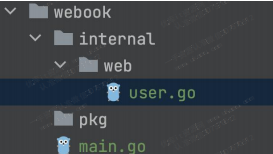

## 定义 Handler

我们从用户模块开始起步。对于一个用户模块来说，最先要设计的接口就是：注册和登录，而后要考虑提供：编辑和查看用户信息。

这里，直接在 `web/user.go` 定义了一个 `UserHandler`，然后将所有和用户有关的路由都定义在了这个到 Handler 上。同时，也定义了一个 `RegisterRoutes` 的方法，用来注册路由。

```go
type UserHandler struct {
}

func (u *UserHandler) RegisterRoutes(server *gin.Engine) {
	server.POST("/users/signup", u.SignUp) // 登录
	server.POST("/users/login", u.Login) // 注册
	server.POST("/users/edit", u.Edit) // 编辑
	server.GET("/users/profile", u.Profile) // 获取用户信息
}
```

你可以注意到，我用定义在 `UserHandler` 上的方法来作为对应路由的处理逻辑。在简单的应用里面，这是一种不错的 Web 代码组织方式，**比如说我后续可以有 `ArticleHandler` 啥的**。

`UserHandler` 上的 `RegisterRoutes` 是一种**分散注册路由**的做法。还有一种**集中式**的做法，比如说在 `main` 函数里面将所有的路由都注册好。

```go
func main() {
	server := gin.Default()
	u := web.NewUserHandler()
	server.POST("/users/signup", u.SignUp)
	server.POST("/users/login", u.Login)
	server.POST("/users/edit", u.Edit)
	server.GET("/users/profile", u.Profile)

	server.Run(":8080")
}
```

两种方式各有优缺点：

- 分散式注册

  - 优点：比较有条理。

  - 缺点：找路由的时候不好找

- 集中式注册

  - 优点：打开你就能看到全部路由。

  - 缺点：路由太多的时候，你找起来很费劲。

另外，我们所有的路由都有 `/users` 这个前缀，要是手一抖就有可能写错，这时候可以考虑使用 `Gin` 的分组路由功能。

```go
func (u *UserHandler) RegisterRoutes(server *gin.Engine) {
	// 分组注册
	ug := server.Group("/users")
	ug.POST("/signup", u.SignUp)
	ug.POST("/login", u.Login)
	ug.POST("/edit", u.Edit)
	ug.GET("/profile", u.Profile)
}
```

## 后端处理步骤

类似于把大象放进冰箱，后端处理也就是三步骤：

- 接收请求并校验

- 调用业务逻辑处理请求

- 根据业务逻辑处理结果返回响应

本次我们先来重点讨论**接收请求并校验**这一部分。

### 接收请求

（1）接收请求结构体

 一般来说，我们都是定义一个结构体来接收数据。这里我们使用了方法内部类 `SignUpReq` 来接收数据。这样做的好处是除了这个 `SignUp` 方法能够使用 `SignUpReq`，其它方法都用不了。你也可以考虑定义在外面，跟习惯、公司偏好相关。**我建议优先使用内部类。**如果 Bind 方法发现输入有问题，它就会直接返回一个错误响应到前端。

```go
// SignUp 用户注册接口
func (u *UserHandler) SignUp(ctx *gin.Context) {
	// 不想在别的地方用, 所以定义在这里
	type SignUpReq struct {
		Email           string `json:"email"`
		Password        string `json:"password"`
		ConfirmPassword string `json:"confirmPassword"`
	}
    
    // TODO: 其它逻辑
}
```

（2）Bind 方法

Bind 方法是 Gin 里面最常用的用于接收请求的方法。Bind 方法会根据 HTTP 请求的 **Content-Type** 来决定怎么处理。比如我们的请求是 JSON 格式，Content-Type 是 `application/json`，那么 Gin 就会使用 `JSON` 来反序列化。

```go
// SignUp 用户注册接口
func (u *UserHandler) SignUp(ctx *gin.Context) {
	// ...

	var req SignUpReq
	// 当我们调用 Bind 方法的时候，如果有问题，Bind 方法已经直接写响应回去了
	if err := ctx.Bind(&req); err != nil {
		return
    }
    
	// ...
}
```

### 校验请求

（1）校验的内容

在我们这个注册的业务里面，校验分成校验邮箱和密码两块：

- 邮箱需要符合一定的格式：也就是账号这里，必须是一个合法的邮箱。

- 密码和确认密码需要相等：这是为了确保用户没有输错。

- 密码需要符合一定的规律：要求用户输入的密码必须不少于八位，必须要包含数字、特殊字符。

（2）校验的方式

- 校验请求，用正则表达式

  ```go
  isEmail, err := u.emailRegexExp.MatchString(req.Email)
  isPassword, err := u.passwordRegexExp.MatchString(req.Password)
  ```

- 预编译

  我们可以预编译正则表达式来提高校验速度。

  ```go
  const (
  	emailRegexPattern = "^\\w+([-+.]\\w+)*@\\w+([-.]\\w+)*\\.\\w+([-.]\\w+)*$"
  	// 和上面比起来，用 ` 看起来就比较清爽
  	passwordRegexPattern = `^(?=.*[A-Za-z])(?=.*\d)(?=.*[$@$!%*#?&])[A-Za-z\d$@$!%*#?&]{8,}$`
  )
  
  type UserHandler struct {
  	emailRegexExp    *regexp.Regexp
  	passwordRegexExp *regexp.Regexp
  }
  
  func NewUserHandler() *UserHandler {
  	return &UserHandler{
  		emailRegexExp:    regexp.MustCompile(emailRegexPattern, regexp.None),
  		passwordRegexExp: regexp.MustCompile(passwordRegexPattern, regexp.None),
  	}
  }
  ```

- 更换强大包

  Go 正则表达式不支持部分语法。类似于 ?=. 这种就不支持。所以我们换用另外一个开源的正则表达式匹配

  库：`github.com/dlclark/regexp2`。

  ```go
  import (
  	regexp "github.com/dlclark/regexp2"
  	"github.com/gin-gonic/gin"
  	"net/http"
  )
  ```

整体的校验逻辑如下：

```go
// SignUp 用户注册接口
func (u *UserHandler) SignUp(ctx *gin.Context) {
	// 不想在别的地方用, 所以定义在这里
	type SignUpReq struct {
		Email           string `json:"email"`
		Password        string `json:"password"`
		ConfirmPassword string `json:"confirmPassword"`
	}

	var req SignUpReq
	// 当我们调用 Bind 方法的时候，如果有问题，Bind 方法已经直接写响应回去了
	if err := ctx.Bind(&req); err != nil {
		return
	}

	isEmail, err := u.emailRegexExp.MatchString(req.Email)
	if err != nil {
		ctx.String(http.StatusOK, "系统错误")
		return
	}
	if !isEmail {
		ctx.String(http.StatusOK, "邮箱不正确")
		return
	}

	if req.Password != req.ConfirmPassword {
		ctx.String(http.StatusOK, "两次输入的密码不相同")
		return
	}

	isPassword, err := u.passwordRegexExp.MatchString(req.Password)
	if err != nil {
		ctx.String(http.StatusOK, "系统错误")
		return
	}
	if !isPassword {
		ctx.String(http.StatusOK,
			"密码必须包含数字、字母、特殊字符，并且长度不能小于 8 位")
		return
	}

	ctx.String(http.StatusOK, "hello, 注册成功")
}
```

## 实验步骤

### 切换源码

```shell
$ git checkout v0.10
```

### 注册成功

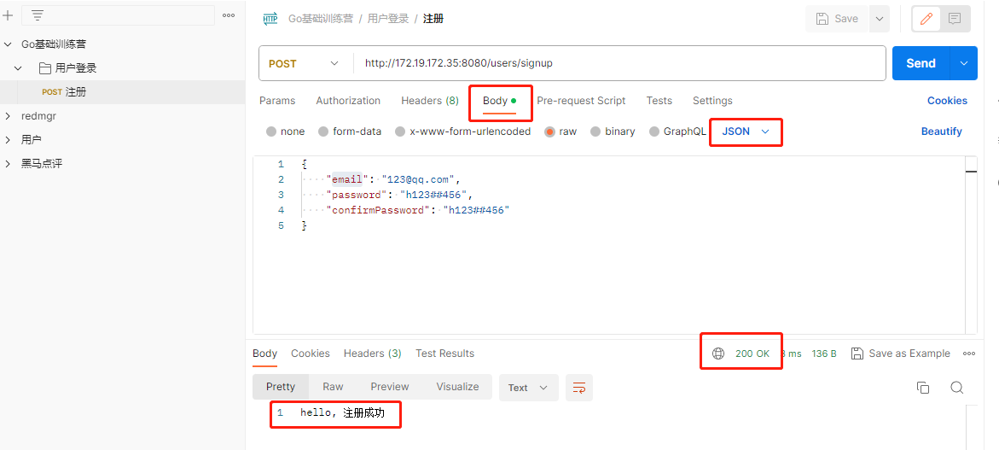

### 注册失败

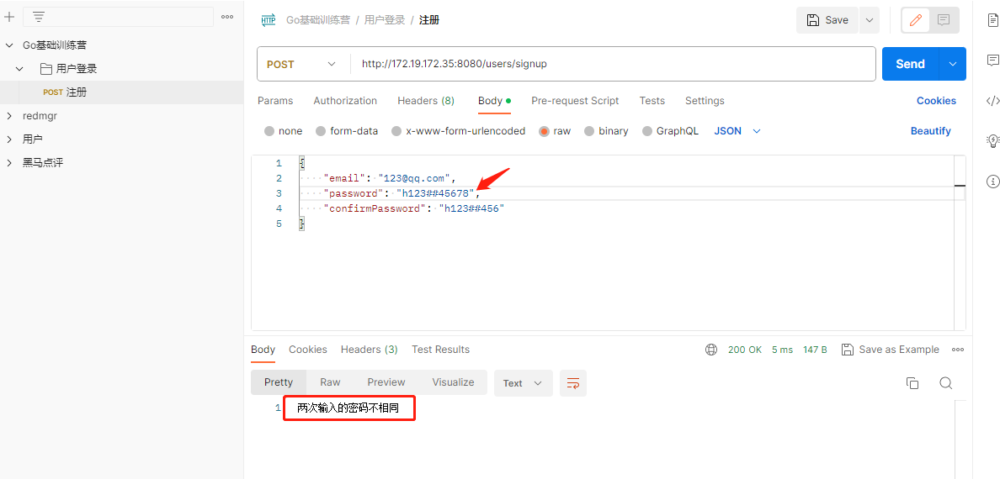

# 跨域问题

## 什么是跨域

如果我们的请求是从 localhost:3000 这个前端发到后端 localhost:8080 的，这种就是跨域请求。**协议、域名和端口**任意一个不同，都是跨域请求。 正常来说，如果我们不做额外处理，你是没办法这么发请求的。

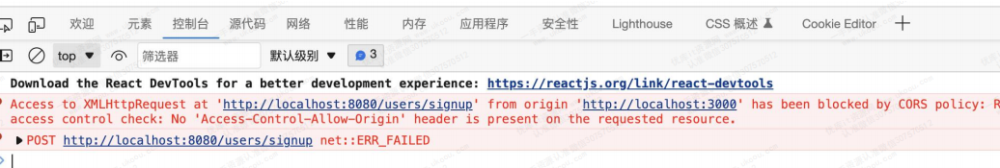

## 解决思路

跨域请求的解决思路也很简单，**就是告诉浏览器，我这个 localhost:8080 能够接收从localhost:3000 过来的请求。**那么怎么告诉浏览器呢？这就要讲到浏览器的一个机制了，所谓的 preflight请求。你需要在 preflight 请求里面告诉浏览器，我允许接收 localhost:3000 发过来的请求。

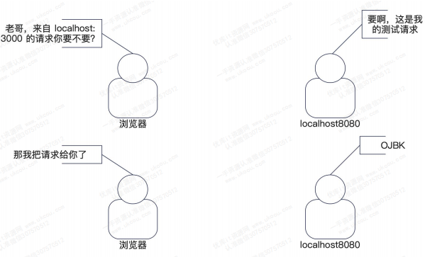

preflight 请求的特征： 这个 preflight 请求，会发到同一个地址上，使用 Options 方法，没有请求参数。

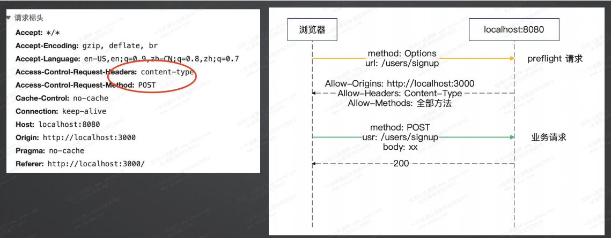

## 解决方案

可以采用中间件来解决跨域问题。目前大多数的 Web 框架，都提供了 CORS 的解决方案。Gin 里面也提供了一个 middleware 实现来解决跨域问题，执行 `go get github.com/gin-contrib/cors` 之后就可以在代码中使用。

```go
func corsHandler() gin.HandlerFunc {
	return cors.New(cors.Config{
		AllowCredentials: true,
		// 在使用 JWT 的时候，因为我们使用了 Authorization 的头部，所以要加上
		AllowHeaders: []string{"Content-Type", "Authorization"},
		// 为了 JWT
		ExposeHeaders: []string{"X-Jwt-Token"},
		AllowOriginFunc: func(origin string) bool {
			if strings.HasPrefix(origin, "http://") {
				// 开发环境
				return true
			}
			return strings.Contains(origin, "your_company.com")
		},
		MaxAge: 12 * time.Hour,
	})
}

func main() {
	// ...
	server.Use(corsHandler())
	// ...
}
```

## 实验步骤

### 启动前端

(1) 下载源码

```shell
 $ git clone https://gitee.com/geektime-geekbang_admin/geektime-basic-go.git 
```

(2) 修改后端地址

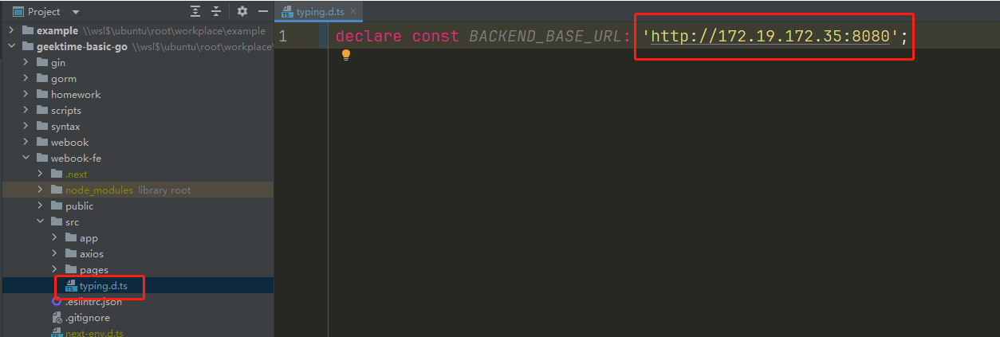

(3) 安装启动

```shell
$ npm install
$ npm run dev 
```

(4) 访问 http://172.19.172.35:3000/users/signup

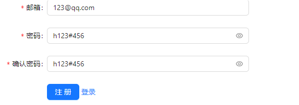

### 没有解决跨域前

用 v0.10 的代码测试

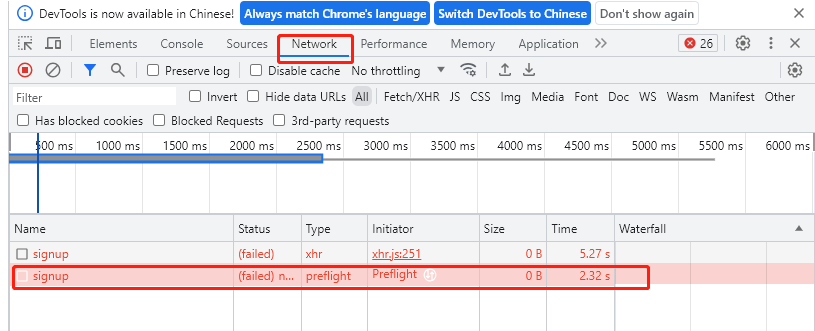

### 解决跨域后

把代码切换到 v0.11 重新运行后测试

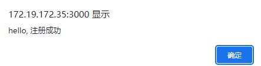

# 数据库创建

## 安装 MySQL

使用 docker compose 安装。

```yaml
version: "3.5"
services:
  mysql8:
    image: mysql:8.0.29
    restart: always
    command: --default-authentication-plugin=mysql_native_password
    environment:
      MYSQL_ROOT_PASSWORD: root
    volumes:
      # 设置初始化脚本
      - ./script/mysql/:/docker-entrypoint-initdb.d/
    ports:
      # 注意这里我映射为了 13316 端口
      - "13316:3306"
  redis:
    image: 'bitnami/redis:latest'
    environment:
      - ALLOW_EMPTY_PASSWORD=yes
    ports:
      - '6379:6379'
```

初始化脚本如下，其实就是建立数据库

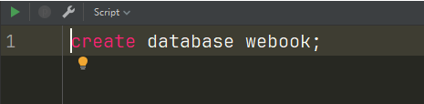

## 连接数据库

使用Goland的 Database 工具连接

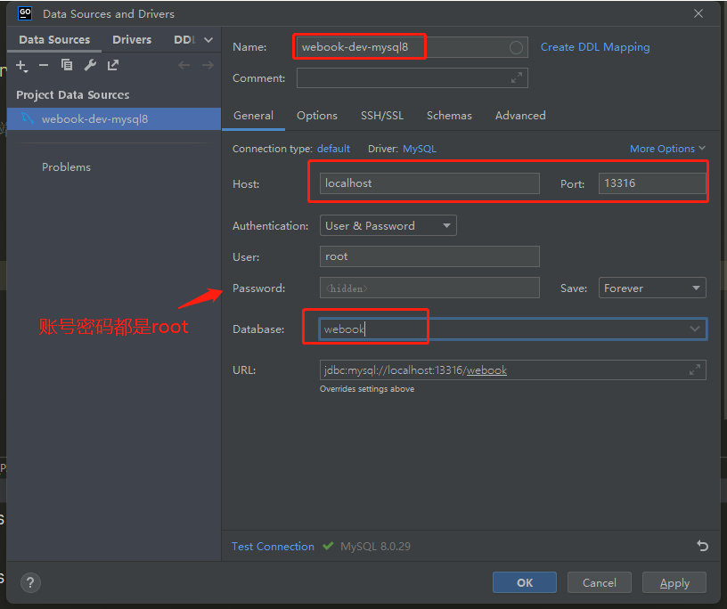

右键刷新下就可以看见数据库同步过来了

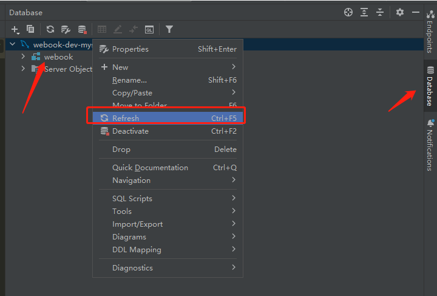

# 设计项目结构

## 目录设计

数据库准备好了，现在就要考虑，数据库相关的增删改查代码放在哪里比较好？能不能直接在 `UserHandler` 里面操作数据库？

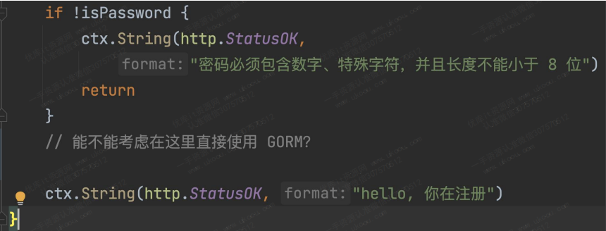

答案是不能。因为 Handler 只是负责和 HTTP 有关的东西。我们需要一个代表数据库抽象的东西。这里我们直接引入 `Service - Repository - DAO` 三层结构。其中 `service`、`repostory` 参考的是 `DDD`设计。

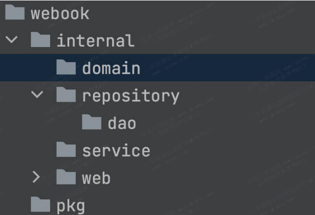

- service：代表的是领域服务（domain service），代表一个业务的完整的处理过程。
- repository：按照 `DDD` 的说法，是代表领域对象的存储，这里你直观理解为存储数据的抽象。
- dao：代表的是数据库操作。

同时，我们还需要一个 domain，代表领域对象。

- 为什么有 repository 之后，还要有 dao？repository 是一个整体抽象，它里面既可以考虑用ElasticSearch，也可以考虑使用 MySQL，还可以考虑用 MongoDB。所以它只代表数据存储，但是不代表数据库。

- service 是拿来干嘛的？简单来说，就是组合各种 repository、domain，偶尔也会组合别的 service，来共同完成一个业务功能。

- domain 又是什么？它被认为是业务在系统中的直接反应，或者你直接理解为一个业务对象，又或者就是一个现实对象在程序中的反应。

总结起来，预期中的调用流程如下图：

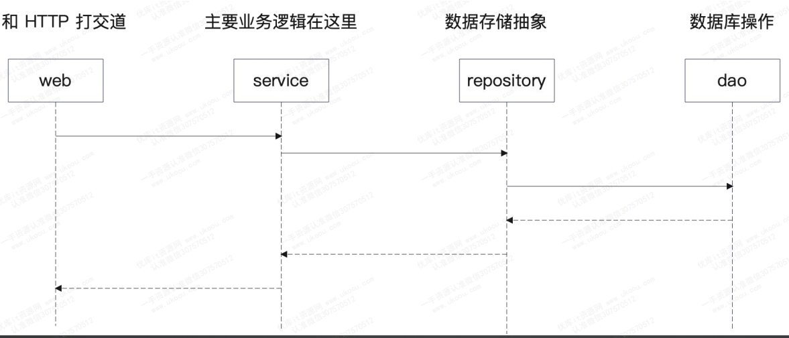

## 代码改造

### Handler 层

初始化时传入 service

```go
type UserHandler struct {
	svc              *service.UserService // 引入 service 
	emailRegexExp    *regexp.Regexp
	passwordRegexExp *regexp.Regexp
}

func NewUserHandler(svc *service.UserService) *UserHandler {
	return &UserHandler{
		svc:              svc, // 引入 service 
		emailRegexExp:    regexp.MustCompile(emailRegexPattern, regexp.None),
		passwordRegexExp: regexp.MustCompile(passwordRegexPattern, regexp.None),
	}
}
```

然后调用 Service 层的代码进行用户注册

```go
// SignUp 用户注册接口
func (u *UserHandler) SignUp(ctx *gin.Context) {
	// ...

	err = u.svc.SignUp(ctx, domain.User{
		Email:    req.Email,
		Password: req.Password,
	})
	if err != nil {
		ctx.String(http.StatusOK, "系统异常")
		return
	}

	ctx.String(http.StatusOK, "hello, 注册成功")
}
```

### Service层

在 service 层调用 repository 层的代码

```go
type UserService struct {
	repo *repository.UserRepository
}

func NewUserService(repo *repository.UserRepository) *UserService {
	return &UserService{repo: repo}
}

// SignUp 不能把Handler层的request传进来，因为 service 在 Handler 的下层, 不能用上层的东西
// user 不用指针原因: (1) 不需要判断空指针 (2)消耗不了多少性能
func (svc *UserService) SignUp(ctx context.Context, u domain.User) error {
	return svc.repo.Create(ctx, u)
}
```

并且service层 request 是定义在 domain 中

```go
type User struct {
	Email    string
	Password string
	// ConfirmPassword 不需要, 因为已经在Handler层处理过了
}
```

### Repository层

```go
type UserRepository struct {
	dao *dao.UserDao
}

func NewUserRepository(dao *dao.UserDao) *UserRepository {
	return &UserRepository{dao: dao}
}

// UserRepository 在 repository 层没有注册的概念，所以叫 create
func (repo *UserRepository) Create(ctx context.Context, u domain.User) error {
	// 有缓存就在这里操作
	return repo.dao.Insert(ctx, dao.User{
		Email:    u.Email,
		Password: u.Password,
	})
}
```

### Dao 层

```go
type UserDao struct {
	db *gorm.DB
}

func NewUserDao(db *gorm.DB) *UserDao {
	return &UserDao{db: db}
}

func (dao *UserDao) Insert(ctx context.Context, u User) error {
	now := time.Now().UnixMilli()
	u.CTime = now
	u.UTime = now
	// 注意要传指针
	return dao.db.WithContext(ctx).Create(&u).Error
}

// User 对应数据库表
type User struct {
	Id       int64  `gorm:"primaryKey,autoIncrement"`
	Email    string `gorm:"unique"`
	Password string
	// 创建时间
	CTime int64
	// 更新时间
	UTime int64
}
```

我们 dao 里面操作的并不是 domain.User，而是定义了一个新的类型。这是因为：domain.User 是业务概念，它不一定和数据库中表或者列完全对应得上。而 dao.User 则是直接映射到表里面的。

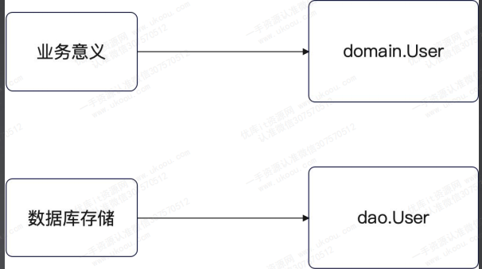

### mian 函数

在 main 函数里，组装好全部东西，而后抽取到不同的方法里面。

（1）initDB

```go
func initDB() *gorm.DB {
	db, err := gorm.Open(mysql.Open("root:root@tcp(localhost:13316)/webook"))
	if err != nil {
		panic(err)
	}
	err = dao.InitTables(db)
	if err != nil {
		panic(err)
	}
	return db
}
```

一般在规范比较严格的公司里面，表结构变更都是要走审批流程的。相当于你提供 SQL 给你 leader 看，然后给DBA 看，最后再由 DBA 在目标库上执行。评审最重要的就是看你的索引对不对。

不过在中小企业，可以考虑使用 GORM 自带的建表功能。

```go
func InitTables(db *gorm.DB) error {
	return db.AutoMigrate(&User{})
}
```

后续有新的数据要存储，都要来这里初始化一下表。

（2）initUser

```go
func initUser(db *gorm.DB) *web.UserHandler {
	userDao := dao.NewUserDao(db)
	userRepository := repository.NewUserRepository(userDao)
	userService := service.NewUserService(userRepository)
	return web.NewUserHandler(userService)
}
```

（3）initServer

```go
func initServer() *gin.Engine {
	server := gin.Default()
	server.Use(corsHandler())
	return server
}
```

（4）main 

```go
func main() {
	db := initDB()
	server := initServer()
	user := initUser(db)
	user.RegisterRoutes(server)
	server.Run(":8080")
}
```

## 实验步骤

代码切换到 tag v0.12, 我注册了两个不同的数据。

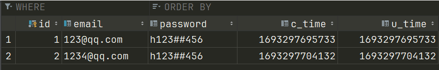

# 密码加密

## 加密位置

  实际上，你选择 service、repository、dao, 包括 domain 都有说得过去的理由。  

- service 加密：加密是一个业务概念，不是一个存储概念。
-  repository 加密：加密是一个存储概念，毕竟我们说的是“加密存储”。
-  dao  加密：加密是一个数据库概念，因为我完全可以选择利用数据库本身的加密功能来实现。
-  domain  加密：加密是一个业务概念，但是应该是“用户（User）”自己才知道怎么加密。  

这种就是编程里面比较无聊的、没有正确答案的实践问题。**这里我选择  service 加密**，也就是认为加密是业务逻辑的一部分，但是它不是 domain 应该管的。

## 加密算法

## 加密效果

## 获取邮箱错误

## 实验步骤

# 登录功能

# 深入讨论 Session 

# JWT

# 保护登录系统

